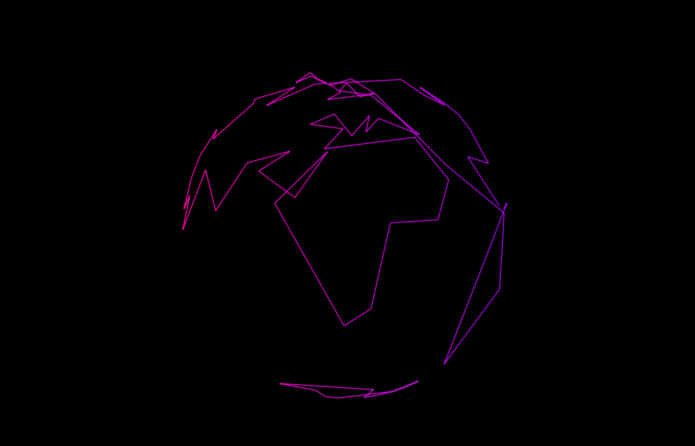

# wkt2glsl

a hacky command for creating `glsl` arrays from `wkt`

create the wkt:
```
psql -d natural_earth \
    -c "select ST_AsText(ST_Collect(ST_Transform(wkb_geometry, 4326))) from ne_110m_coastline;" > coast.wkt
```

run the go program to simplify the geometry and generate the `glsl` array

```
cat coast.wkt | go run main.go > simplified.txt
```

results:


view it live:

https://www.shadertoy.com/view/fdX3RN
